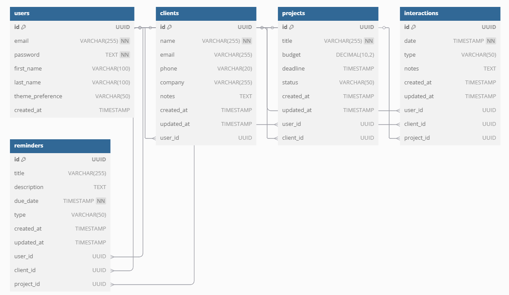
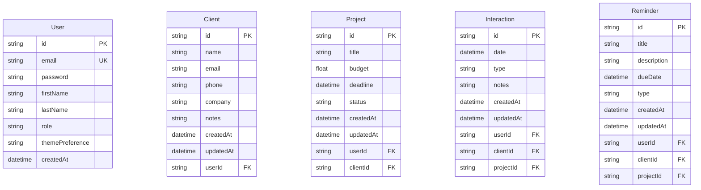

# Entity Relationship Diagram (ERD)

## Database Schema Overview

The HELLOCLIENT CRM system uses a PostgreSQL database with the following entity relationships:

## Entity Descriptions

### User
The core entity representing system users. Includes authentication details, personal information, and preferences.
- **Key Features**:
  - Theme preference support
  - Customizable dashboard preferences

### Client
Represents business clients or customers.
- **Key Features**:
  - Basic contact information
  - Company details
  - Notes for additional information
  - Associated with multiple projects and interactions

### Project
Represents client projects with associated budgets and deadlines.
- **Key Features**:
  - Budget tracking
  - Deadline management
  - Status tracking
  - Associated with clients and users

### Interaction
Records various types of client interactions.
- **Key Features**:
  - Date and time tracking
  - Type categorization (call/meeting/email)
  - Detailed notes
  - Can be associated with clients and/or projects

### Reminder
Manages various types of reminders in the system.
- **Key Features**:
  - Due date tracking
  - Can be associated with projects

## Relationships

1. **User Relationships**:
   - One-to-Many with Client (A user can manage multiple clients)
   - One-to-Many with Project (A user can create multiple projects)
   - One-to-Many with Interaction (A user can create multiple interactions)

2. **Client Relationships**:
   - Many-to-One with User (Many clients can be managed by one user)
   - One-to-Many with Project (A client can have multiple projects)
   - One-to-Many with Interaction (A client can have multiple interactions)

3. **Project Relationships**:
   - Many-to-One with User (Many projects can be managed by one user)
   - Many-to-One with Client (Many projects can belong to one client)
   - One-to-Many with Interaction (A project can have multiple interactions)

4. **Interaction Relationships**:
   - Many-to-One with User (Many interactions can be created by one user)
   - Many-to-One with Client (Many interactions can be associated with one client)
   - Many-to-One with Project (Many interactions can be associated with one project)
